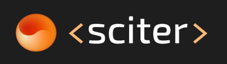

# Build cross platform desktop applications with HTML, CSS and script!

+ Creating desktop screens is easy using [sciter](https://sciter.com/).
  
+ See more on [GitHub](https://github.com/sciter-sdk/go-sciter).
  
+ Maybe these [videos](https://www.youtube.com/playlist?list=PLub5C2vM5SjKvkbFfposhyg1V2gpXnviM) will help me understand how the library works.
  
+ Creating screens with GO + HTML + CSS + SCRIPT
  
  - [Hello World](ui-hello-world/README.md).
  - [Notes](ui-notes/README.md).
  - [Login Discord-clone](ui-login/README.md).
  - [To-Do List](ui-to-do-list/README.md).

+ My impressions:
  
  - Ease of use.
  - With a few kb, we do a lot, unlike the Electron. Which also produces cross-platform desktop applications.
  - I didn't find the documentation and items of this in an easy way, however on the [website](https://sciter.com/) you can search for problems efficiently.
  - Embeddable, can be used with any programming language.
  - Does not support all CSS 3 features 😥.
  - We do not use JavaScript, but TIScript is an extended version of ECMAScript. Which is not necessarily a bad thing, but at the beginning it produces a certain discomfort, see more [here](https://sciter.com/developers/for-web-programmers/tiscript-vs-javascript/)